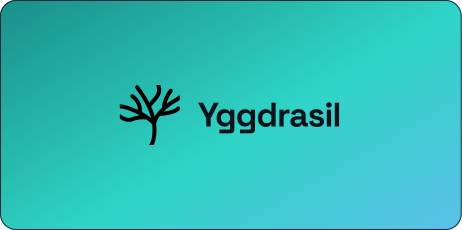

<div align="center">
  <picture>
    <source media="(prefers-color-scheme: dark)" srcset="branding/svg/horizontal-lockup.svg">
    
  </picture>
</div>

**AI-orchestrated software development for small teams and individuals.** Describe what to build — agents handle the rest.

> Early development — not yet available for general use.

---

## What is Yggdrasil?

Yggdrasil is a platform where you describe features in plain language and AI coding agents autonomously build them — creating branches, opening pull requests, and streaming progress back in real time. Any GitHub-hosted codebase, any language or framework.

## How it works

Three components work together:

- **Web** — web app where you create projects, write feature specs, and monitor agent runs
- **API** — API and database that manages state, GitHub tokens, and dispatches work to the Orchestrator
- **Orchestrator** — the execution layer that spins up isolated Docker containers, runs the AI agent, and tears down cleanly

## AI-first development

AI is the primary way people contribute to this codebase. Because of that, documentation is treated as a first-class part of the code — every submodule has a `CLAUDE.md` that guides agents through its structure.

If you make a change that affects how something works, update the relevant doc. This keeps the codebase navigable for both humans and AI tools.

## Repo structure

This is the meta repository. Application code lives in submodules:

| Path | What lives there |
|---|---|
| `web/` | React/Next.js web app |
| `api/` | REST + WebSocket API, PostgreSQL |
| `orchestrator/` | Docker-based job executor |
| `landing/` | Marketing website |
| `docusaurus/` | End-user documentation site |

## Getting started

Clone with all submodules:

```sh
git clone --recurse-submodules git@github.com:yggdrasil-hq/yggdrasil-core.git
```

## Contributing

See [CONTRIBUTING.md](CONTRIBUTING.md).
